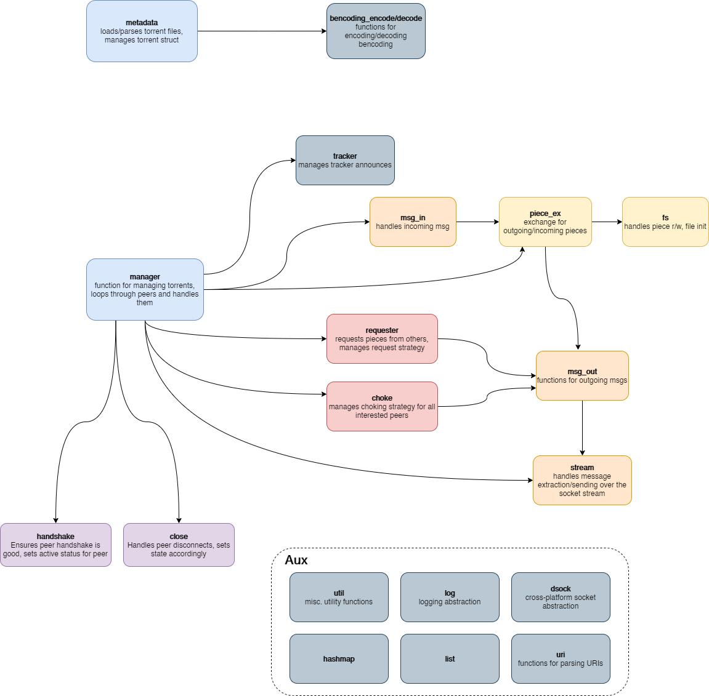

# libdtorr

#### BitTorrent library written in C. Linux/Windows

No threading occurs in this library, since it uses non-blocking I/O.

Implements BEP 3 and BEP 23.

Library designed/developed for the [dtorr](https://github.com/djandries/dtorr) client.

## Build/usage

Run `make`. Library outputted to `lib` folder. Test programs outputted to `bin` folder.

`test_manage` is best for testing downloads/uploads, and saving torrent state.

### Linux dependencies

OpenSSL development libraries (for SHA1), gcc, make

### Suggested Windows environment

- MSYS2
- Mingw-w64 toolchain (gcc/make)
- OpenSSL

## Design

## Current limitations

- No DHT, only http trackers allowed
- Very simple choking algorithm, chokes peers at random if there are many peers